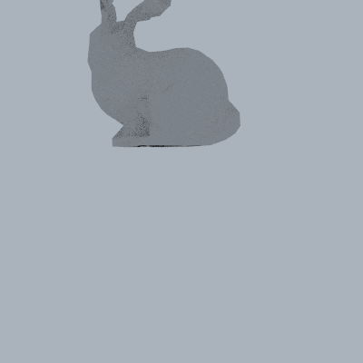

This is a silly idea I had last year...

Some raytracers use a data structure called a kD-tree to store all the objects
in the scene. The kD-tree narrows down the set of objects you have to check ray
intersections with, speeding up the rendering process. It does this by
repeatedly splitting up the space using planes parallel to the XY, YZ, or XZ
planes, essentially creating a spatial binary tree.

Because the planes are aligned to the axes, it turns out that you _might_ be
able to do slightly better by rotating your entire scene a little bit. What do
I mean by "do better"? I mean lower the number of ray-object intersection tests
that need to be done. Clearly there's no way to know this ahead of time, but
there's a good heuristic called the Surface Area Heuristic (SAH) that assumes
that rays will be roughly randomly distributed around the scene.

The idea was to "learn" an optimal rotation by gradient descent on SAH.
Specifically, given a function that takes a set of vertices and puts them in a
kD-tree, returning the SAH, I want to find some optimal rotation R on those
vertices that minimizes that function. This requires the SAH computation, and
thus the kD-tree generation, to be "differentiable" (i.e. all math is done on
PyTorch tensors...).

Okay, okay, so does it work? I'm not sure. It's doing _something_ (see the GIF
of the rotating rabbit below, notice that it "converges" eventually!) but I
have not yet tried it on a scene large enough to get a perceptible speed bump
out of PBRT. It's possible that there is a small speedup but it's negligible
enough to get wiped out in statistical noise...

---

Besides `numpy` and `torch`, you also need the Python `plyfile` module:
https://github.com/dranjan/python-plyfile

I've been testing things on a Stanford bunny model:
http://graphics.stanford.edu/data/3Dscanrep/

And here are some CS348B notes on accelerators... in fact the lecture that
inspired this whole idea in the first place:
http://graphics.stanford.edu/courses/cs348b/lecture/rt2
